# Advanced Lane Lines Detection with Adaptive Virtual Sensors
This Project is the fourth task of the Udacity Self-Driving Car Nanodegree program. The main goal of the project is to write a  software pipeline to identify the lane boundaries in a video from a front-facing camera on a car. Basically, it is an advinced version of the [Lane Line detection](https://github.com/NikolasEnt/LaneLine-project) project.

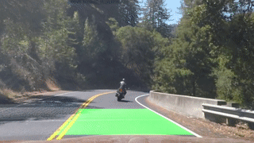

__Results:__ [video 1](https://www.youtube.com/watch?v=1YaguCWMklc);  [video 2](https://www.youtube.com/watch?v=aOaV-RHMg2U);  [video 3](https://www.youtube.com/watch?v=tgQwXVzhrBI)

## Content of this repo

- `LaneLine.ipynb` Jupyter notebook with code for the project
- `video_proc` a directory with processed videos
- `test_images` a directory with test images
- `camera_cal` a directory with camera calibration images


## Camera Calibration

Implementation of the camera calibration process is based on build-in OpenCV functions.

### Measuring Distortion

To measure distortion of a camera it is possible to use photos of real world object with well-known shape. In the case, chessboard pattern was used.

OpenCV functions `findChessboardCorners()` and `drawChessboardCorners()` were used to automatically find and draw corners in an image of a chessboard pattern. "Object points", which will be the (x, y, z) coordinates of the chessboard corners in the real world were prepared  assuming the chessboard pattern is fixed on the (x, y) plane at z=0, such that the object points are the same for each calibration image. Thus, `objp` is just a replicated array of coordinates, and `objpoints` is appended with a copy of it every time `findChessboardCorners()` successfully detect all chessboard corners in a test image. `imgpoints` is appended with the (x, y) pixel position of each of the corners in the image plane with each successful chessboard pattern detection. It is expected to detect 9x6 grid of corners on the calibrated images.

Code of this step is in the first code cell of the Jupyter notebook. Example result of corner detection is depicted below:


Unfortunatly, the `findChessboardCorners()` failed to find desired corners on three images out of 20 provided calibration images, because there were not enought corners on these images due to framing. These frames were not used for distortion measuring.

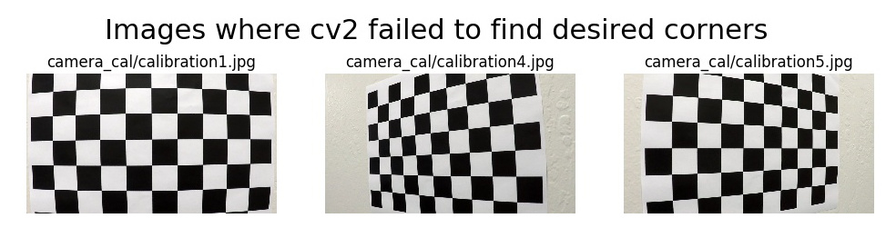

### Computation of camera matrix and distortion coefficients

The output `objpoints` and `imgpoints` were used to compute the camera calibration and distortion coefficients using the `cv2.calibrateCamera()` function. It returns the camera matrix (`mtx`), distortion coefficients (`dist`), rotation and translation vectors, etc. For the code, see the second code cell of the project Jupyter notebook.

### Image undistortion
In the second code cell a function `undistort(img)` was also defined. This functions correct distortion of a given image using the `cv2.undistort()` function and previously computed camera matrix and distortion coefficients. Some sample results are shown below:


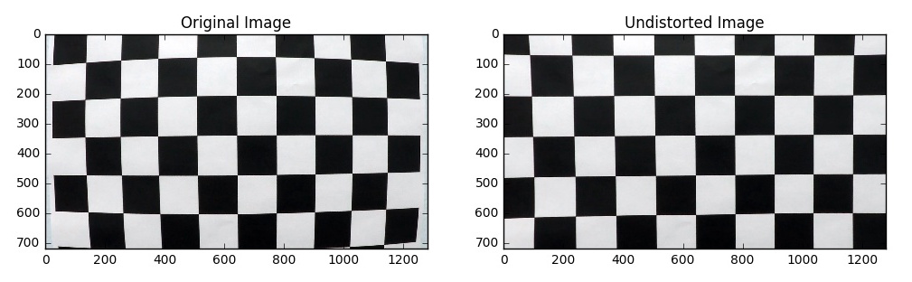

## Image transformation

### Binary images

The code for these operations is presented under *Create of thresholded binary image* header. Different transformation, such as Sobel transformation (including magnitude and direction) were implemented as well as red and saturation channels binary thresholds.

Unfortunately, the optimal combination of these filters which is able to separate pixels of lane line from background on snapshots from all three videos was not found. Shadows and glares are quite challenging. (For first two videos such filter combination was successfully found). That is why an idea of using adaptive thresholds, which is described and discussed in detail below, arose. A red channel image was used for white line finding and on a linear combination of the red and saturation channels (computes as *`img[:,:,2]+0.5*s_hls(img)`* where *s_hls* - returns saturation channel of a given color image) - for the yellow line (red channel only also works for yellow line, but such combination seems to perform better). An example of image, used for yellow line detection, is given below.

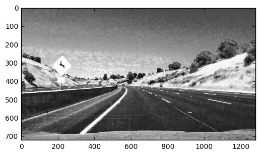

Despite we are not going to directly use binary images, here is an example, how a binary image, prodused out of the above image, could look like.

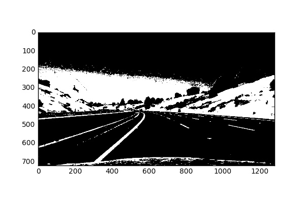

Several useful functions were introduced in this section. It is a common practice to use a histogram normalization before image processing which usually helps to perform better.

```Python
def eq_Hist(img): # Histogram normalization
    img[:, :, 0] = cv2.equalizeHist(img[:, :, 0])
    img[:, :, 1] = cv2.equalizeHist(img[:, :, 1])
    img[:, :, 2] = cv2.equalizeHist(img[:, :, 2])
    return img
```
Other useful functions are in a code chunk under *Transform image* header.

### Bird's Eye View transformation

Parallel lines appear to converge on images from the front facing camera due to perspective. In order to keep parallel lines parallel a bird's eye view transformation was applied. We shrink the bottom edge of an image to produce the same scale of the road to the top edge of the image. The way of transformation was selected because it preserves all avalable pixels from the raw image on the top edge where we have lower relative resolution. To find correct transformation source and destinations  points a test image with flat and straight road was used. We also crop images to skip areas with hood and sky.

The following code computes the bird's eye view transformation matrix (`M`) as well as the matrix for inverse transformation (`Minv`). 

```Python

def create_M():
    src = np.float32([[0, 673], [1207, 673], [0, 450], [1280, 450]])
    dst = np.float32([[569, 223], [711, 223], [0, 0], [1280, 0]])
    M = cv2.getPerspectiveTransform(src, dst)
    Minv = cv2.getPerspectiveTransform(dst, src)
    return M, Minv
```
There is the main image transformation routine `transform` to get a warped image from a raw image. It uses the `M` matrix for perspective transformation with `cv2.warpPerspective(img, M, img_size)`.  Of course, undistortion is applyed before the Bird's Eye View transformation. Warped image is sharpen by the following code and contrast increased as well. 

```Python
def sharpen_img(img):
    gb = cv2.GaussianBlur(img, (5,5), 20.0)
    return cv2.addWeighted(img, 2, gb, -1, 0)
    
def lin_img(img,s=1.0,m=0.0): # Compute linear image transformation img*s+m
    img2=cv2.multiply(img, np.array([s]))
    return cv2.add(img2, np.array([m]))

def contr_img(img, s=1.0): # Change image contrast; s>1 - increase
    m=127.0*(1.0-s)
    return lin_img(img, s, m)
```

Two sample images after undistortion and warping are presented below.

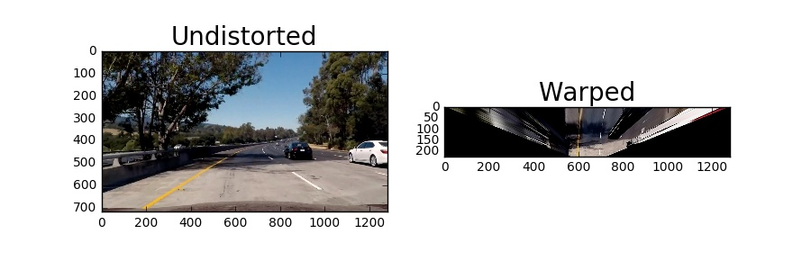
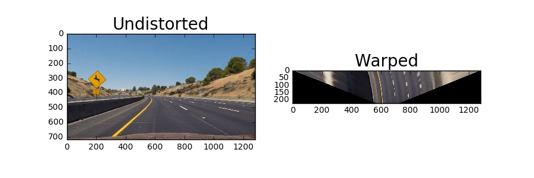

As we can see, parallel lines look roughly parallel. Only such warped images are used for the following analysis. One should note that there could be significant brightness variation of the road on an image due to shadows.

## Ideas
Several ideas arose after some experiments with suggested in the course binary filters.

- Image should be analyzed with adaptive virtual sensors. Each sensor is a string of pixels (for example, 30 pixels long) in the area where it is expected to find a line.  Virtual sensor can find the line position or can find nothing. The point with the maximum value (brightness) in the virtual sensor is a suspected line point. Line point considered found if its value minus the mean pixels value of the sensor is larger than the threshold and the point is shifted from the sensers center on less than `DEV` pixels.

- Image is analyzed from the bottom to the top because it is the most probable to find a line on the closest to the car road pixels because resolution is higher near to the hood. Position of the next sensor is predicted by position of the previous line point (in case of a still image) position or calculated from the polinomial fit of points which were found on the previous frame (in case of a video). 

- Threshold value should be selected independently for each virtual sensor based on mean value of pixels in the sensor. In general, the threshold should be as large as possible to reduce false positive results. But in the bright areas it should be less because the region marred by the sunlight and  line contrast decreased. It should also be less for the dark areas, as the line is poorly distinguishable in the dark. It allows to find line points on an image with both deep shadows and bright areas which is very challenging in case of using a constant threshold for the whole image. 

- Polynomial fit on the set of points, found by virtual sensors, is then applied. The best order of the polynomial should be chosen for each points set individually. 

- If only one line is visible, then the second can be carried out as an equidistant at road width distance from the first one.

## Math help functions

To implement the above ideas several mathematical functions are to be implemented.

It is expected to use polynomial of degree <=3. First and second derivatives for such polynomials can be computed by `pol_d` and `pol_dd` functions respectively.

### Radius of curvature and offset

One of the tasks is to estimate radius of the road curvature and the position of the vehicle with respect to the lane center. That is why it is needed to transform measurements in pixels into meters. To perform such scale convertation scale coefficients were identified from a warped image of a straight road. X scale was estimated out of the lane width, Y scale - out of dash line length.

```Python
xm_in_px = 3.675 / 85 # Lane width (12 ft in m) is ~85 px on image
ym_in_px = 3.048 / 24 # Dashed line length (10 ft in m) is ~24 px on image
```

The radius of curvature is given in meters assuming the curve of the road follows a circle. Radius of lanes curvature was calculated out of polinomial lane lines approximation by the `r_curv` function by a formula from a [website](http://www.intmath.com/applications-differentiation/8-radius-curvature.php), which was recomended in the course notes, in the closest to the vehicle point. If the calculated radius is bigger than `MAX_RADIUS = 10000` then the `MAX_RADIUS` value is returned (and inprinted onto video frame as *Inf*) because such a big radiuses of curvature are very unaccurate and can be considered as a straight line. The computed radiuses for left and right lines were averaged before inprinting onto video frame. Offset from the lane center was estimated as lane offset in pixels, converted to meters by the `lane_offset` function. It was assumed that the camera is mounted at the center of the car and the deviation of the midpoint of the lane from the center of the image is the desired offset.

### Equidistant

An equidistant is needed in case only one line is well determined (the other one is the equidistant because lane lines are parallel). It is known that an equidistant for a polynomial function is a higher order polynomial function. However, it is needed to have not higher then 3rd order polynomial in order to make line fitting robust and stable. That is why an approximation was used: we create a list of equidistant points for the given polinomial (points laying on a straight lines, perpendicular to the given polynomial at selected points on a desired distance) and fit them with a same order polinomial function. The `np.polyfit` function is used for fitting. See the code chunk under *Equidistant for a polynomial* header. An example plot is given below.

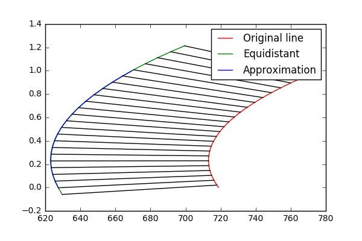

### Order of a polynomial

One of the key ideas of the project is the usage of the reasonable minimal order of polinomial functions for lines fitting. The function `best_pol_ord` chooses such order (See *Choose the best polynomial order* code chunk). It starts from a linear function and, if it does not perform well enough, increases the polinomial order (up to 3). It returns polinomial coefficients and mean squared error of the selected approximation. The function stops increasing the order if it does not help (mean squared error drops not significant in case of higher order) or in case the mean squared error is small enough (`< DEV_POL`).

It is possible to use a simple low pass filter or an alpha-beta filter for smoothing polynomial coefficients of the same degree. But for two polynomial with different orders a dedicated function `smooth_dif_ord` was introduced. It calculates average x position of points for a given function f(y) at y values from the new dataset and fit these new average points with polinomial of desired degree.

## Line finding

The described above ideas on points finding were implemented in the `find` function. It is able to deal with video frames as well as with still images and involves different adaptive thresholds for yellow and white line.

The inverse transformation and drawing lane line on an image performed in the same way to suggested in the lectures. The function `draw_line` can just visualize found lane line on an image, or, in case of video, it also inprints radius of the road curvature and the vehicle offset from the lane center.

### Pipeline visualization
After image warping the algorithm perform points finding by the described in *Ideas* section points finding approach. Basically, virtual sensors are  filters with an adaptive region-of-interest and adaptive threshold.

Each virtual sensor considers points which have values higher than mean pixel value in the sensor plus the threshold value (it is a kind of local binary image for the virtual sensor). The threshold value is calculated for each sensor individually based on the mean value of pixels in the sensor. The line point is the pixel with the maximum value among all considered pixels. The sensor position (ROI) determinated by the position of the previously detected line point (for still images) or by the polynomial fit of line points from the previous frame (for videos).

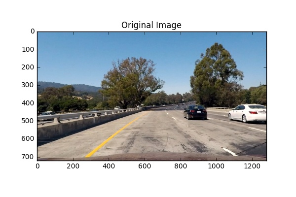
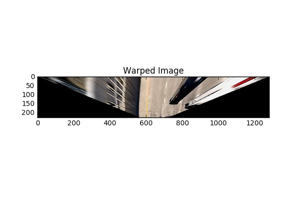
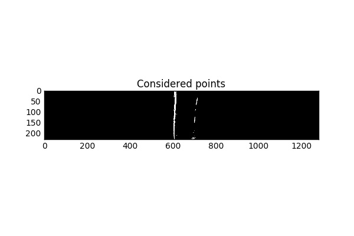
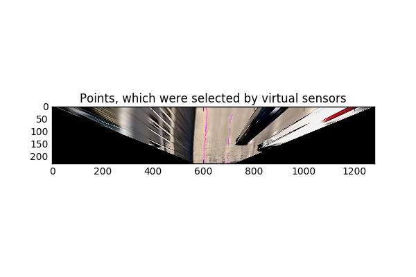
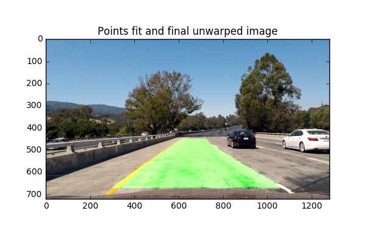

There are some extra examples of the points finding and inverse transformation of the lane on a real images from the provided test images set and on a snapshot from the `harder_challenge_video.mp4`. More examples could be found in the [LaneLine.ipynb](https://github.com/NikolasEnt/Advanced-Lane-Lines/blob/master/LaneLine.ipynb).

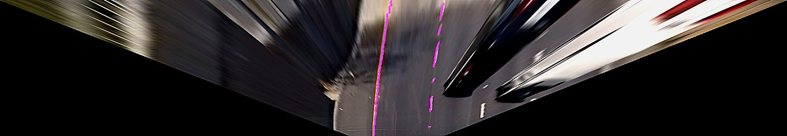  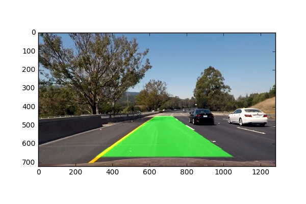

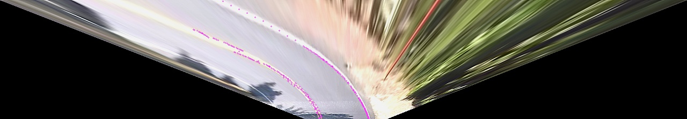  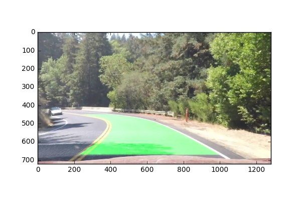

## Video processing

In case of video the same approach as for still images is used. However, line detection process involves several additional filterings. The `get_lane_video` function performs these actions. See it under *Find lane on video* header in the [LaneLine.ipynb](https://github.com/NikolasEnt/Advanced-Lane-Lines/blob/master/LaneLine.ipynb)

The previous polynomial is used to specify region of search for the `find` algorithm. Line considered as detected only if there are more than `MIN_POINTS` points found. If it fails to find the line for more than `MAX_N` video frames, it starts search from scratch (it deals with the frame as with a still image on the first video frame or in case of line lost). It also skips strange results with very narrow or wide lanes. If it has no ideas about lane position for more than `MAX_N` frames, it stop drawing anything on the video.

In case a line is successfully detected, its coefficients are filtered with weights proportional to the number of found points in the line (it seems to be quite reliable measure of the algorithm confidence about the found line) to smooth jitter. Global variables `right_fit_p, left_fit_p` are used to transfer previous polynomial coefficient between video frames to use them in line smoothing.

If only one line (only left or only right) is detected, then the algorithm uses the equidistant function to draw the necessary line.

## Results and discussion

Resulting videos are in the [video_proc](https://github.com/NikolasEnt/Advanced-Lane-Lines/tree/master/video_proc) directory. 

The algorithm demonstrated ability to correctly identify lane lines on the [project_video.mp4](https://github.com/NikolasEnt/Advanced-Lane-Lines/blob/master/video_proc/project_video_proc.mp4), [challenge_video.mp4](https://github.com/NikolasEnt/Advanced-Lane-Lines/blob/master/video_proc/harder_challenge_video_proc.mp4) and to some extent on the [harder_challenge_video.mp4](https://github.com/NikolasEnt/Advanced-Lane-Lines/blob/master/video_proc/harder_challenge_video_proc.mp4).

Probably, radius of road curvature is underestimated (about 400 m for the *project_video.mp4*) because of not accurate enough scale determination. Nevertheless, it is a correct value in order of magnitude. 

It should be noted that the algorithm assumes lane lines parallelity on the warped images (for example, when it uses equidistant to draw an absent line), which is not true in case of hilly terrain and in such situations the algorithm may fail. 

Despite of usage of adaptive sensors, which allow to perform quite well in different conditions, the algorithm may fail in difficult light conditions, in case of flares or glares. It should be mentioned that most of glares from the dashboard on the windshield may be eliminated by shielding of camera by a simple visor.

Glare on the road, appearing, for example, under trees, may lead to noisy results. Additional issues could happen due to poor condition of road marking, intersection of different lines. It could partly be resolved by additional line filtering between video frames.

However, the main problem is the absence of road marking lines or their invisibility. Lines on the road could by invisible due to dust or, as it happens more often, snow coverage or autumn leaves on the road. Partly snow coverage could confuse the algorithm as well because wind may form intricate snow patterns on the road. More sophisticated algorithms (such as deep neural networks) should be applied in the case of line absence in order to predict and determinate where the lane position should be.

## Further ideas

- The video filtering algorithm can be improved in order to make it more robust on the *harder_challenge_video.mp4* and other real-world videos.

- It was noted that in case of dashed line the points finding algorithm identify each individual dash as a group of points. So, one can track them in order to have some speed estimation.

- It is may be a good idea to change the lines points finding algorithm to use the same parameters for yellow and white lines.
